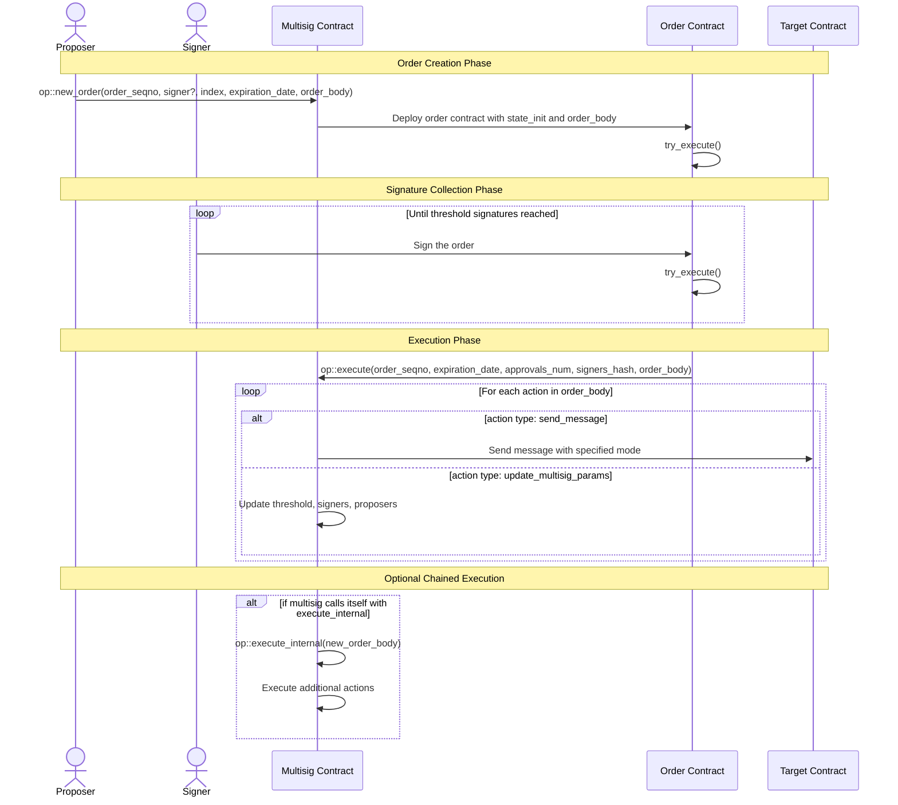

# Ton Multisig-v2
## Flow


## Create Order
wallet sends a msg to the multisig contract with the body:
```
[op::new_order (op code)]
[query_id (64 bits)]
[order_seqno (32 bits)]
[signer? flag (1 bit)]
[index (8-16 bits)]
[expiration_date (32-64 bits)]
=> (order_body cell) [...]

where order_body cell looks like this:
[
  => (dictionary of actions) [
    [key_0 (32 bits)]
    => (action_0 cell) [
      [action_op (action type)]

      // If action_op == actions::send_message
      [mode (8 bits)]
      => (message cell) [
        [message body]
      ]

      // OR if action_op == actions::update_multisig_params
      [threshold (8-16 bits)]
      => (signers dictionary cell) [
        [signers dictionary]
      ]
      => (proposers dictionary cell) [
        [proposers dictionary]
      ]
    ]

    [key_1 (32 bits)]
    => (action_1 cell) [
      // Action data
    ]

    // ... more actions
  ]
]
```

- (multisig) state update: next_order_seqno += 1
- (multisig) calculate state init and `send_message_with_state_init_and_body()` to create the order, and the msg looks like this
```
// State Init (not visible in the message body)
[order contract code]
[initial data: multisig_address, order_seqno]

// Message Body
[op::init (0x9c73fba2)]
[query_id (64 bits)]
[threshold (8 bits)]
[signers (dictionary cell reference)]
[expiration_date (timestamp)]
=> (order_body cell) [...]
[approve_on_init flag (1 bit)]
[signer_index (if approve_on_init is true)]
```
- (order) check sender is multisig addr
- (order) `add_approval(signer_index)`
  - sets bit at signer_index position in approvals_mask
  - increment approvals_num
- (order) `try_execute(query_id)`
  - check if approvals_num == threshold
  - if threshold reached, send msg with `op::execute` and `order_seqno` to multisig

## Approve Order
wallet sends a msg to the order contract with the body:
```
[op::approve (0xa762230f)]
[query_id (64 bits)]
[signer_index (8 bits)]
```
- check that order is not already executed with `sent_for_execution?` flag
- check that signer at `signer_index` is authorized using signers dictionary
- `add_approval(signer_index)`' (same as in create order)
- send confirmation message back to signer with `op::approve_accepted` and `query_id`
- `try_execute(query_id)` (same as in create order)

## Execute Order
when threshold is reached, order sends this message to multisig:
```
[op::execute (0x75097f5d)]
[query_id (64 bits)]
[order_seqno (32 bits)]
[expiration_date (timestamp)]
[approvals_num (8 bits)]
[signers_hash (256 bits)]
=> (order_body cell) [...]
```
- verify sender is the order address (calculated from order_seqno)
- verify signers hash matches current signers AND approvals_num >= threshold
- verify expiration_date >= now()
- `execute_order(order_body)`
  - iterate through each action in order_body
  - if `action_op == actions::send_message`, sends msg with body
  - if `action_op == actions::update_multisig_params`, updates multisig params


